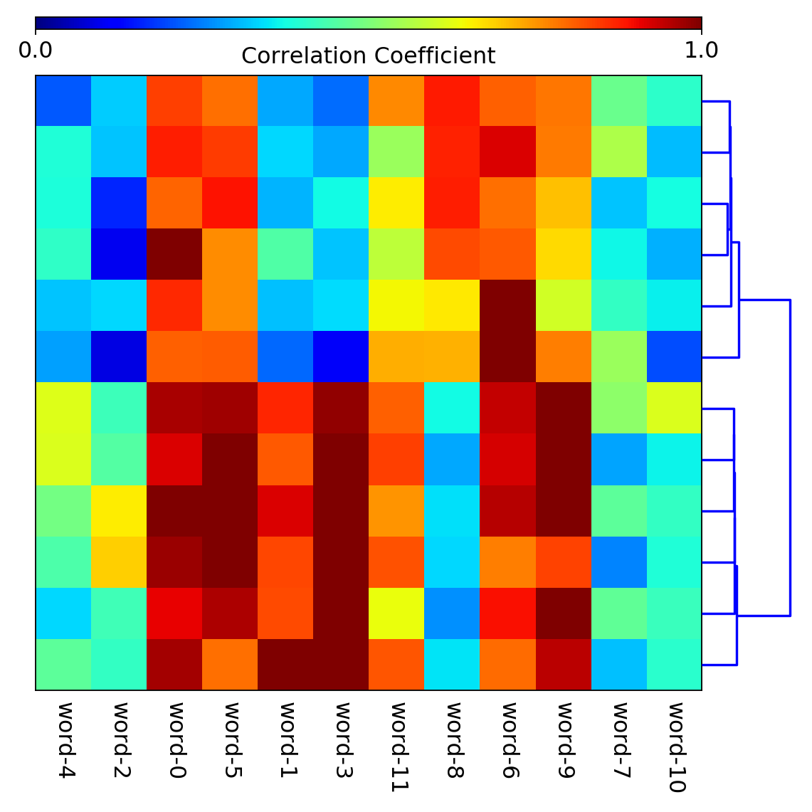
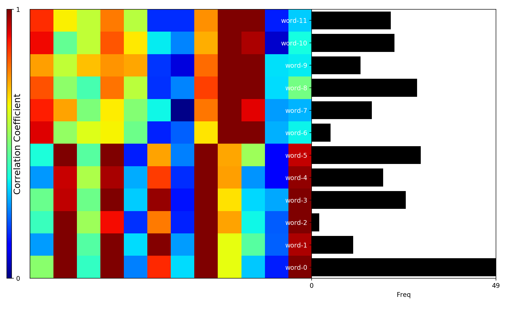
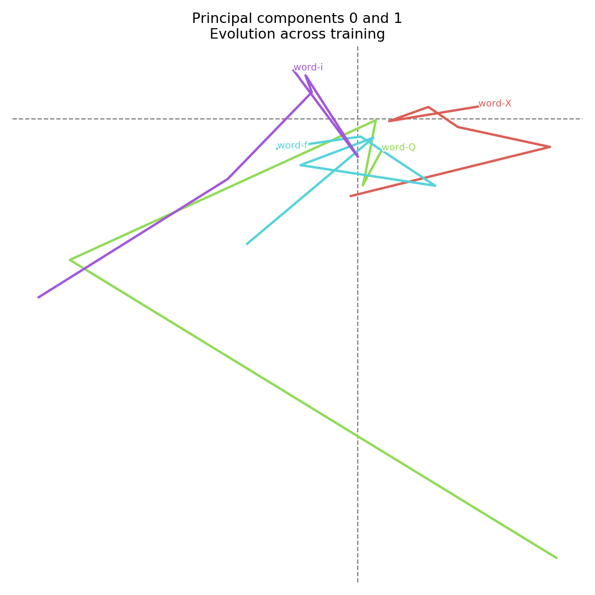
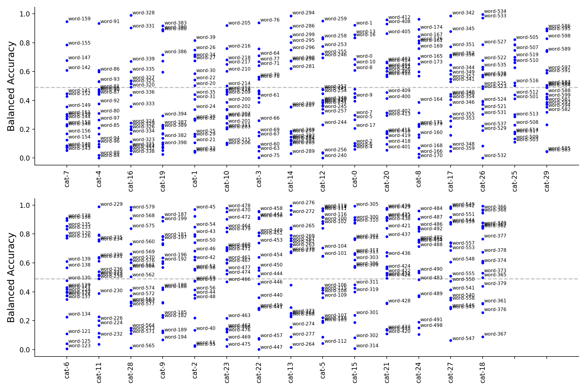
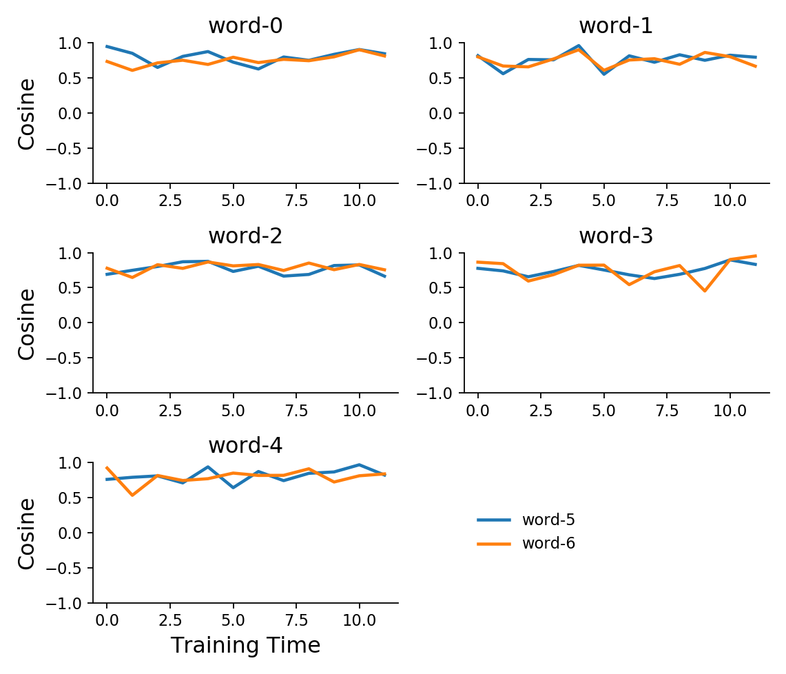
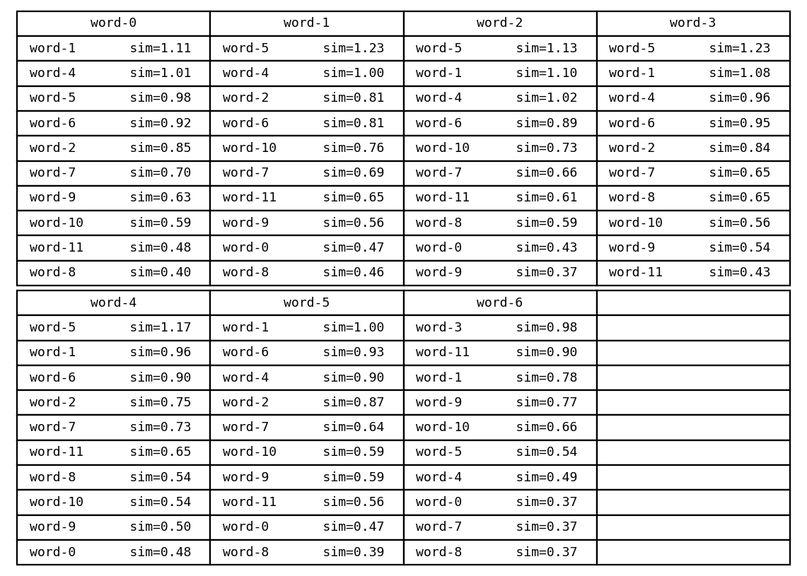
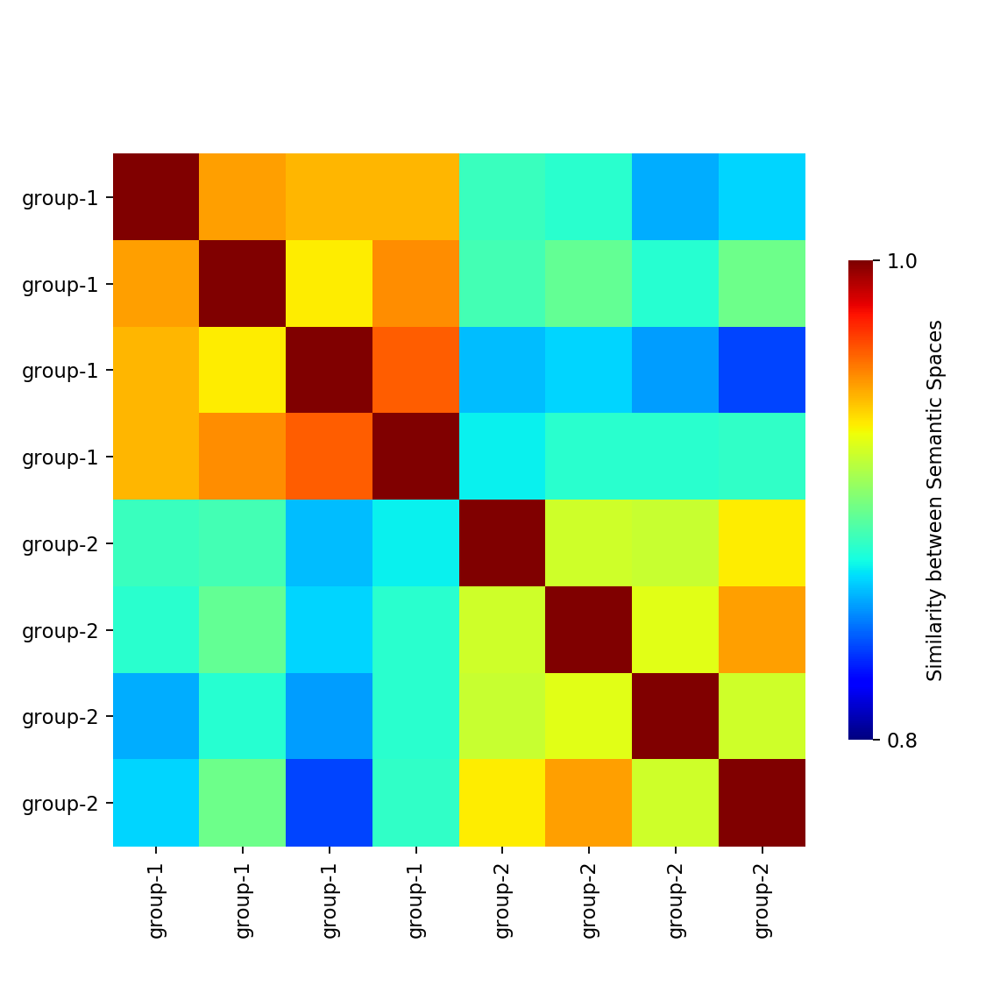
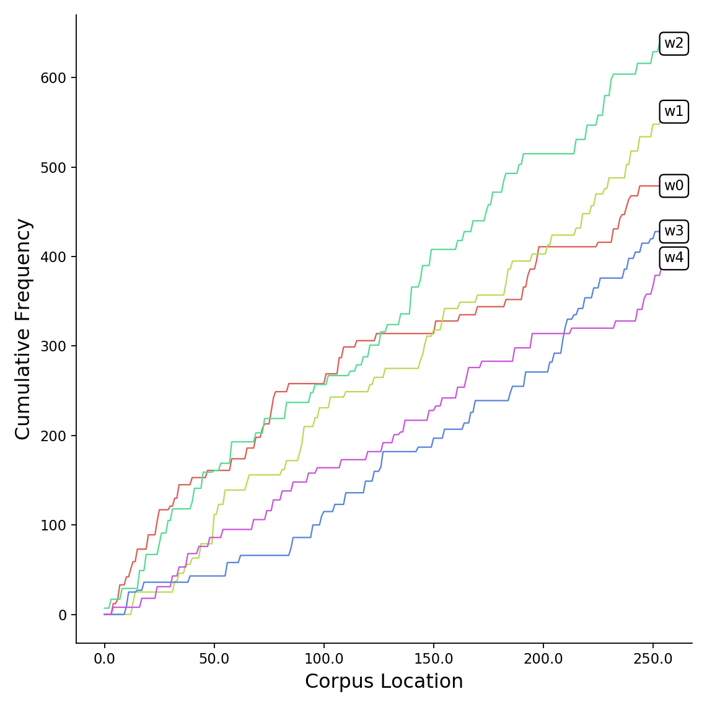
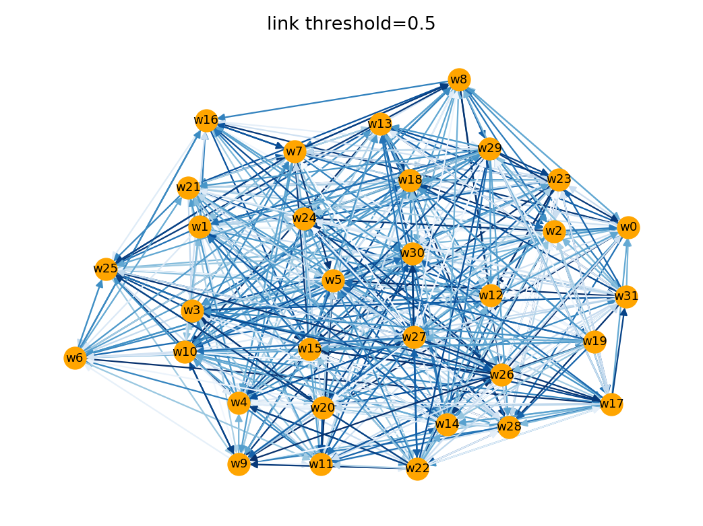

<div align="center">
  
</div>

A collection of useful plotting functions previously used to analyze word embeddings of neural networks

## Figures

### Dendrogram-Heatmap

Shows heatmap clustered by row or column-similarity or both.



Note about labeling y-axis ticks:
In matplotlib, by default, y-axis tick labels from the top rather than the origin of the y-axis.
But when using dendrograms, one needs to set the extent of the main axis, which reverses this behavior, such that
y-axis tick labels start at the origin - this means they need to be reversed to label the rows of the matrix correctly

### Dendrogram-Heatmap + Bar Plot

Shows heatmap clustered by row or column-similarity or both, and a bar plot (e.g. for indicating each word's frequency)




### PCA across Time

Shows evolution of pattern of activations on 2 principal components across training time.



### Balanced Accuracy by Category

Shows a measure of categorization performance (e.g. balanced accuracy) for each word, in each category.



### Cosine Time Course

Shows cosine similarity between a set of test and reference embeddings across training time.



### Nearest Neighbors

Shows nearest neighbors of a set of test words in an embedding space.



### Embeding Space Comparison

Shows similarity between embedding spaces belonging to a set of model groups.




### Cumulative Word Frequency Time course

Shows cumulative frequency for words across ordered partitions of a corpus.



### Network from Correlation Matrix

Shows network of nodes connected if their correlation is above some threshold.



## Tips & Tricks

### Fontsize

```python
import matplotlib.pyplot as plt

fix, ax = plt.subplots()

plt.setp(ax.get_yticklabels(), fontsize=12)
plt.setp(ax.get_xticklabels(), fontsize=12)
```

### Tick Label Format

```python
from matplotlib.ticker import FormatStrFormatter
import matplotlib.pyplot as plt

fix, ax = plt.subplots()

ax.yaxis.set_major_formatter(FormatStrFormatter('%.1f'))
```

### Embedding matplotlib figures in a html page (e.g. served by flask)

Use the following function to convert matplotlib figure objects to a format readadble by the browser:

```Python
from io import BytesIO
import base64

def figs_to_imgs(*figs):
    imgs = []
    for fig in figs:
        print('Encoding fig...')
        figfile = BytesIO()
        fig.savefig(figfile, format='png')
        figfile.seek(0)
        img = base64.encodebytes(figfile.getvalue()).decode()
        imgs.append(img)
    return imgs
```

Next, install the `flask` which ships witht eh `Jinja2` templating language: 

```bash
pip install flask
```

And put the following in your html template file:

```html

```

## Compatibility

Developed using Python 3.8 on Ubuntu 16.04